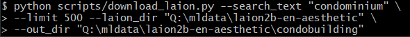

# download_laion.py

This script enables you to webscrape using the Laion parquet files which are available on Huggingface.co. 

It has been tested with 2B-en-aesthetic, but may need minor tweaks for some other datasets that contain different columns.  Keep in mind some other files are purely sidecar metadata.

https://huggingface.co/datasets/laion/laion2B-en-aesthetic

The script will rename downloaded files to the best of its ability to the TEXT (caption) of the image with the original file extension, which can be plugged into the new class of caption-capable DreamBooth apps or the EveryDream trainer that will use the filename as the prompt for training.  

One suggested use is to take this data and replace regularization images with ground truth data from the Laion dataset.

It should execute quite quickly as it uses async task gathers for the the HTTP and fileio work. 

Default folders are /laion for the parquest files and /output for downloaded images relative to the root folder, but consider disk space and point to another location if needed.

## Examples

Query all the parquet files in ./laion for any image with a caption (TEXT) containing "a man" and attempt top stop after downloading (approximately) 50 files:

    python scripts/download_laion.py --search_text "a man" --limit 50

Query for person with a leading and trailing space:

    python scripts/download_laion.py --search_text " person " --limit 200

Query for both "man" and "photo" anywhere in the caption, and write them to z:/myDumpFolder instead of the default folder.  Useful if you need to put them on another drive, NAS, etc.  The default limit of 100 images will apply since --limit is omitted:

    python scripts/download_laion.py --search_text "man,photo" --out_dir "z:/myDumpFolder" --laion_dir "x:/datahoard/laion5b"

## Performance

Script should be reasonably fast depending on your internet speed.  I'm able to pull 10,000 images in about 3 1/2 minutes on 1 Gbit fiber.  

## Other resources

Nvidia has compiled a close up photo set: [ffhq-dataset](https://github.com/NVlabs/ffhq-dataset)

## Batch run

You can throw commands in a shell/cmd script to run several searches, but I will leave this exercise to the user.

    python scripts/download_laion.py --search_text "jan van eyck" --limit 200
    python scripts/download_laion.py --search_text " hokusai" --limit 200
    python scripts/download_laion.py --search_text " bernini" --limit 200
    python scripts/download_laion.py --search_text "Gustav Klimt" --limit 200
    python scripts/download_laion.py --search_text "engon Schiele" --limit 200